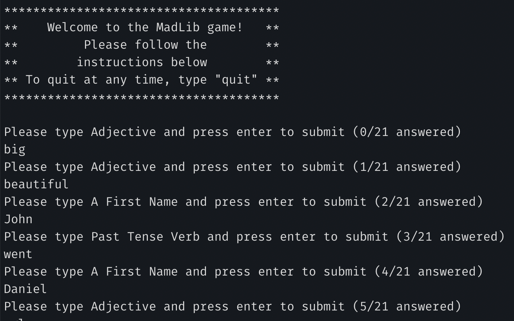
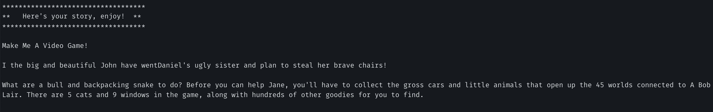

# MadLib Game

_Author: Leo Kukharau_

---

## Description

This is a Python console application that will ask a user to enter a few words, and then combine them in a funny story that will be printed to console and saved into file.

---

### Getting Started

Clone this repository to your local machine.

```
$ git clone [repo clone url here]
```

### To run the program from VS Code:

Select `File` -> `Open` -> `Project/Solution`

Next navigate to the location you cloned the Repository.

Double click on the `madlib_cli` directory.

Then select and open `malib.py`

---

### Visuals

#### Application Start



#### Application End



---

### Change Log

1.0: _Added basic functionality_ - 06/06/2020
